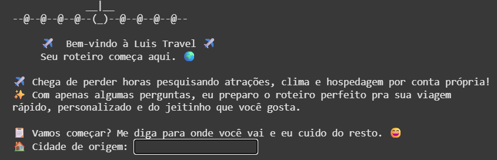
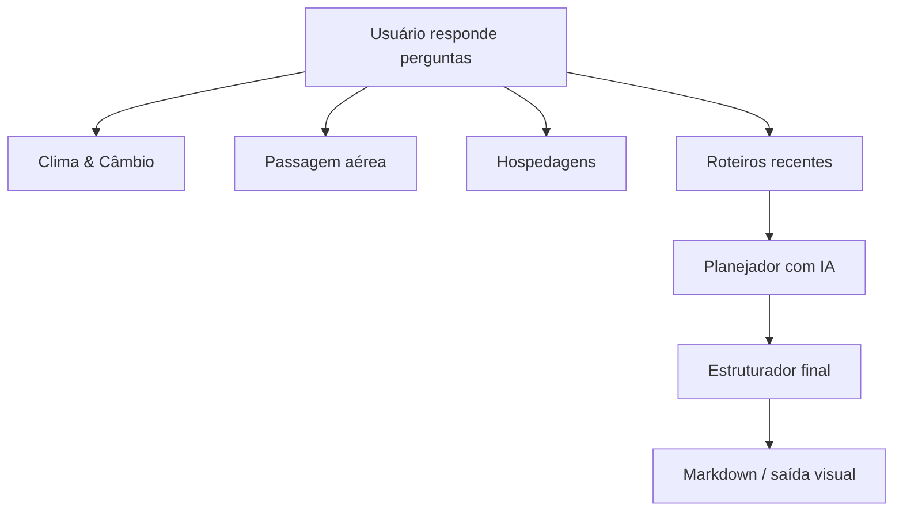
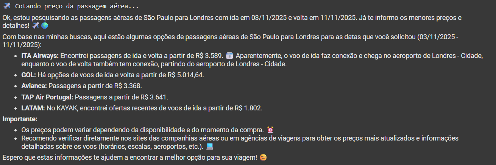
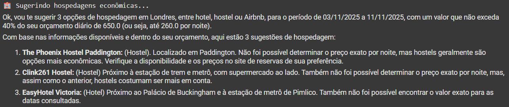

# Luis Travel
<p align="left">
     
</p>

## ✈️ "Seu roteiro ideal, gerado em minutos"

### Introdução

O **Luis Travel** é um aplicativo inteligente que cria roteiros de viagem personalizados de forma automática e instantânea. Basta responder a algumas perguntas simples — como destino, datas, orçamento e preferências — e o sistema entrega um planejamento completo e pronto para uso, com clima, câmbio, passagens, hospedagem econômica, roteiro diário com links do Google Maps e checklist de documentos exigidos para a viagem.

> 🎯 **Problema resolvido:** planejar uma viagem costuma ser demorado e confuso. O Luis Travel centraliza tudo em um único assistente com respostas rápidas e confiáveis.
>
> 👥 **Público-alvo:** viajantes independentes, agências de turismo, plataformas de cashback, criadores de conteúdo e startups que desejam oferecer roteiros como serviço (white-label).
>
> 🚀 **Diferenciais:** integração com Gemini 2 e Google Search em tempo real, além de pós-processamento Python para enriquecer o roteiro com links clicáveis e estrutura visual limpa.

---

## Funcionalidades principais

* 🧠 **Roteiro conversacional inteligente** com IA generativa
* 🌦️ **Clima e câmbio em tempo real**, com emojis e alertas úteis
* ✈️ **Cotação automática de passagem aérea** com horários e valores
* 🏨 **Sugestão de 3 hospedagens** econômicas (≤ 40% do orçamento diário)
* 📅 **Roteiro dia a dia com horários, emojis e links do Google Maps**
* 📄 **Checklist de documentos exigidos**, vistos, vacinas, passaporte
* 📦 **Modo colapsável** para leitura mobile ou interface web
* 🧩 **Pós-processamento Python** que converte texto plano em Markdown rico

---

## Instalação e execução

```bash
# 1. Clone o repositório
$ git clone https://github.com/seu-usuario/luis-travel-agent-ai.git
$ cd luis-travel-agent-ai

# 2. Crie e ative o ambiente virtual
$ python -m venv .venv && source .venv/bin/activate  # macOS/Linux
# ou
> py -m venv .venv && .venv\Scripts\activate        # Windows

# 3. Instale as dependências
$ pip install -r requirements.txt

# 4. Configure a API Key do Google
$ export GOOGLE_API_KEY="sua_chave_aqui"

# 5. Execute a aplicação
$ python luis_travel.py
```

> 💡 **Para usar no Google Colab**: suba `luis_travel.py`, defina a chave via *Settings → Secrets* e rode normalmente.

---

## Arquitetura e funcionamento



* 📌 Agentes criados com **Gemini 2.0 Flash** e orquestrados com `InMemorySessionService`
* 🔍 Todos os agentes usam `google_search` para buscas contextuais em tempo real
* 🧠 Pós-processamento formata o texto com emojis e listas
* 📤 Saída final é exibida em Markdown (Colab) ou HTML colapsável (modo UX)

---

## Ilustrações e demonstrações

<p align="left">
     
</p>

<br />
<br />

* 📸 **Prints** dos trechos com clima
<p align="left">
     
</p>

<br />
<br />

* 📸 **Prints** dos trechos com voos
<p align="left">
     
</p>

<br />
<br />


* 📸 **Prints** dos trechos com hospedagem
<p align="left">
     
</p>


---

## Impacto e mercado

* O mercado global de viagens digitais deve atingir **US\$ 484 bilhões em 2025**, com crescimento anual de 14%.
  [Fonte](https://blog.tbrc.info/2025/05/digital-travel-market-2)
* Apps de viagem superaram **2,1 bilhões de downloads** e geraram **US\$ 180 milhões** em receita em 2024.
  [Fonte](https://asoworld.com/blog/2024-global-travel-app-market-trends-report)
* Espera-se que **reservas mobile** cheguem a **US\$ 526 bilhões até 2032**.
  [Fonte](https://www.nimbleappgenie.com/blogs/travel-app-statistics)

**💼 Conclusão:** o Luis Travel está inserido em um setor em forte expansão, com oportunidade para monetização via white-label, API B2B ou embedded travel.


## Licença

Distribuído sob a **Licença MIT**. Consulte `LICENSE` para mais detalhes.

---

## Agradecimentos

* A equipe do Google ADK e do Gemini pelo ecossistema acessível e poderoso
* A comunidade de dados e turismo por disponibilizar referências de qualidade
* A você, por apoiar e experimentar o **Luis Travel** 💙
